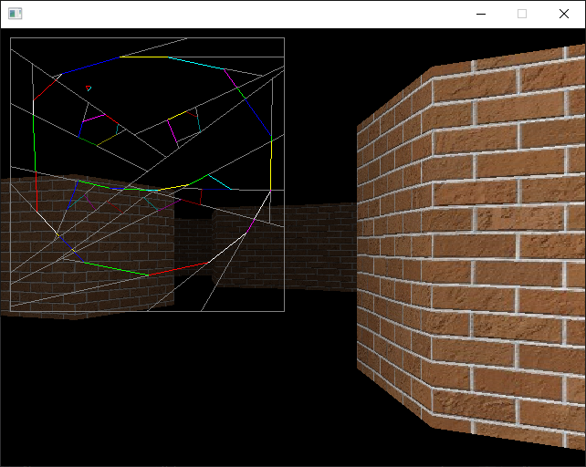

# walls3d
A program used for understanding early '90s first person shooter graphics rendering.

This program grew out of 1) my desire to revisit some "unfinished business" from the later chapter(s) of my '90s high school read-through of [Tricks of the Game Programming Gurus](https://www.goodreads.com/en/book/show/2340474.Tricks_of_the_Game_Programming_Gurus) (now probably a pretty dated book, but super-cool at the time) and 2) my weird obsession with understanding how the original Doom rendering engine worked.

My goal here was not to put something original out into the world, but to try to educate myself and figure out the math and techniques for rendering a "3D" scene like in the Wolfenstein 3D or Doom engines for myself. I wanted to write all the code from scratch, and not copy/paste from anywhere else, to help ensure that I truly understood everything. I worked out the trigonometry and other math stuff in my notebook as I coded, using online resources when necessary.

(As such, things are probably not done the most efficiently, etc.)

After getting a basic raycasting engine working, I wanted to understand the [Binary Space Partitioning (BSP)](https://en.wikipedia.org/wiki/Binary_space_partitioning) approach that was used in the Doom engine, and I added this in as a second renderering system, as well as the ability to toggle between the two in order to compare (and check my BSP work!).

I definitely now have a pretty good understanding of BSP, but to be honest, sometimes I wonder if I really do understand it completely...

Anyway, I hope you can get something out of playing around with this, whether you want to build off of it or use it to help you also understand how this kind of '90s "3D" graphics rendering worked.

## Building and Running
Project files are included for Mac (XCode 7.2.1) and Windows (Visual Studio 2017). The [Simple DirectMedia Layer (SDL) 2 library](https://www.libsdl.org/) is used for graphical output and keyboard input - you should download the appropriate SDL 2 *development* package and modify the walls3d project files to point to the proper location for the SDL header and library files.

Below are the keys that can be used while running the program:

| Key(s)     | Function |
|------------|----------|
| arrow keys | move/turn |
| Alt        | (hold) enable strafing movement |
| Tab        | toggle between raycast rendering and BSP tree rendering |
| s          | show rendering process (slowly) |
| b          | toggle diminished lighting (brightness) |
| t          | toggle texture mapping |
| a          | toggle affine texture mapping (perspective-incorrect)

When in BSP rendering mode, the overhead map shows where the walls have been "split".

## Creating Maps and Reading/Writing BSP Files
You can create your own maps by using a 2D CAD program which can save .dxf files, such as [LibreCAD](https://librecad.org/). The Game class has a LoadFromFile constant and some associated logic which can be used to load a .dxf file. You can also find some code laying around for writing and reading a BSP tree to/from a flat C/C++ array (used with the walls3duino program).

## TODO
Below are some potential future enhancements:
* Don't "cheese out" on line clipping for map drawing.
* Deal with split wall texturing. (Add texture position "u" to wall segment vertices.)
* Use "horizontal center of column" for x scans in both BSP and raycast modes and "pre-step" into angles.
* Fix assert in GetScreenXFromAngle() occasionally triggering (maybe need to clamp).
